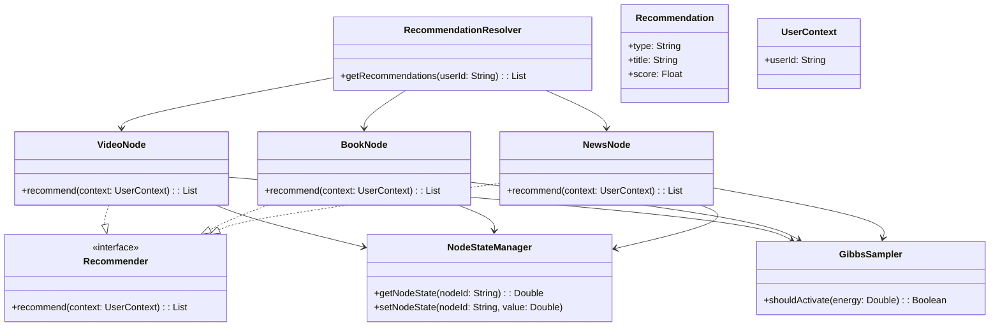

```mermaid
classDiagram
    class RecommendationResolver {
        +getRecommendations(userId: String): List<Recommendation>
    }

    class Recommender {
        <<interface>>
        +recommend(context: UserContext): List<Recommendation>
    }

    class VideoNode {
        +recommend(context: UserContext): List<Recommendation>
    }

    class BookNode {
        +recommend(context: UserContext): List<Recommendation>
    }

    class NewsNode {
        +recommend(context: UserContext): List<Recommendation>
    }

    class NodeStateManager {
        +getNodeState(nodeId: String): Double
        +setNodeState(nodeId: String, value: Double)
    }

    class GibbsSampler {
        +shouldActivate(energy: Double): Boolean
    }

    class Recommendation {
        +type: String
        +title: String
        +score: Float
    }

    class UserContext {
        +userId: String
    }

    RecommendationResolver --> VideoNode
    RecommendationResolver --> BookNode
    RecommendationResolver --> NewsNode

    VideoNode ..|> Recommender
    BookNode ..|> Recommender
    NewsNode ..|> Recommender

    VideoNode --> NodeStateManager
    BookNode --> NodeStateManager
    NewsNode --> NodeStateManager

    VideoNode --> GibbsSampler
    BookNode --> GibbsSampler
    NewsNode --> GibbsSampler

```