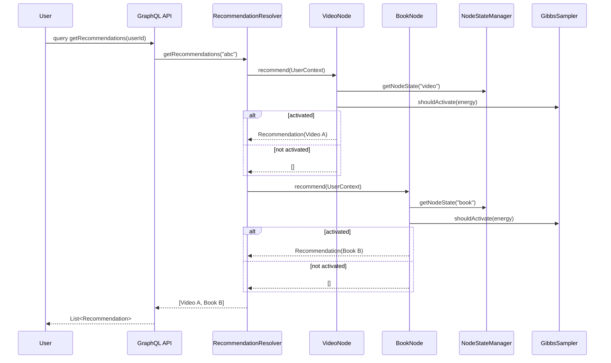

```mermaid
sequenceDiagram
    participant User
    participant GraphQL as GraphQL API
    participant Resolver as RecommendationResolver
    participant Video as VideoNode
    participant Book as BookNode
    participant State as NodeStateManager
    participant Gibbs as GibbsSampler

    User ->> GraphQL: query getRecommendations(userId)
    GraphQL ->> Resolver: getRecommendations("abc")
    Resolver ->> Video: recommend(UserContext)
    Video ->> State: getNodeState("video")
    Video ->> Gibbs: shouldActivate(energy)
    alt activated
        Video -->> Resolver: Recommendation(Video A)
    else not activated
        Video -->> Resolver: []
    end

    Resolver ->> Book: recommend(UserContext)
    Book ->> State: getNodeState("book")
    Book ->> Gibbs: shouldActivate(energy)
    alt activated
        Book -->> Resolver: Recommendation(Book B)
    else not activated
        Book -->> Resolver: []
    end

    Resolver -->> GraphQL: [Video A, Book B]
    GraphQL -->> User: List<Recommendation>

```